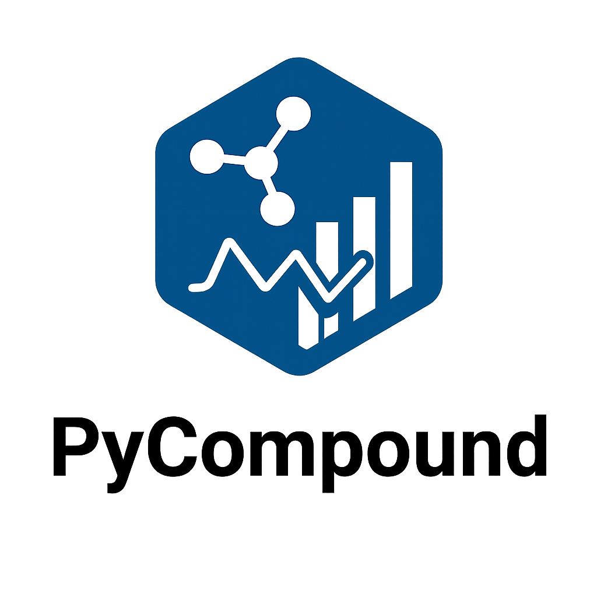
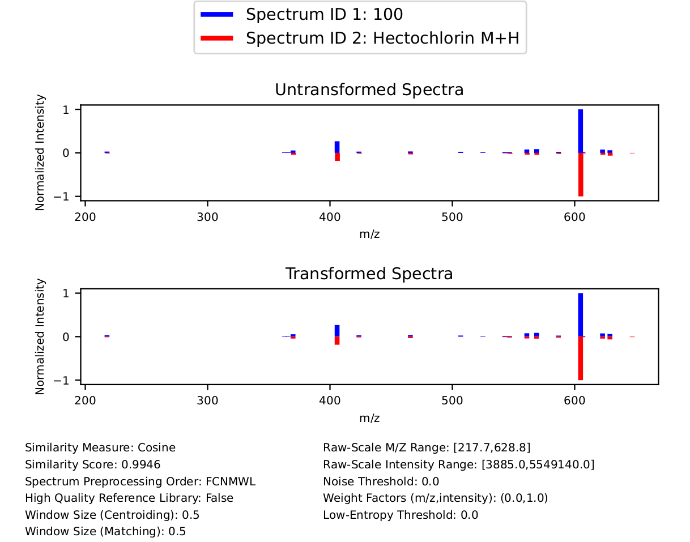

<p align="center">
  
</p>

PyCompound is a Python-based tool for spectral library matching designed to identify chemical compounds from mass spectrometry data. It is available in three formats: a Python package, a command-line interface (CLI), and a graphical user interface (GUI) built with Python/Shiny. PyCompound provides a flexible and extensible framework for spectral library matching and introduces several key features. These include entropy-based similarity measures such as Shannon, Tsallis, and the Rényi entropy similarity measure introduced here for the first time, as well as conventional similarity metrics, including cosine and binary similarity measures. PyCompound supports customizable preprocessing workflows that allow users to explicitly control the order of spectral preprocessing steps. In addition, PyCompound includes transformation parameter optimization using grid search and metaheuristic algorithms, and it supports the construction of user-defined mixture or composite similarity measures by combining two or more similarity metrics. PyCompound supports both high-resolution mass spectrometry (HRMS) data (e.g., LC-MS/MS) and nominal-resolution mass spectrometry (NRMS) data (e.g., GC-MS). The Python package is available on PyPI at [https://pypi.org/project/pycompound/](https://pypi.org/project/pycompound/), and the Shiny app is available at [https://connect.posit.cloud/fy7392](https://connect.posit.cloud/fy7392).

## Table of Contents
- [1. Installation](#create-conda-env)
  - [1.1 Prerequisites by Operating System](#prerequisites)
  - [1.2 Environment Setup & Cloning the Repository](#environment-setup)
  - [1.3 Install PyCompound](#install-pycompound)
  - [1.4 Running PyCompoud](#run-pycompound)
- [2. Functionality](#functionality)
   - [2.1 Spectrum Preprocessing and Transformations](#spec-preprocessing-transformations)
   - [2.2 Similarity Measures](#similarity-measures)
- [3. Usage](#usage)
   - [3.1 Parameter Descriptions](#param_descriptions)
   - [3.2 Obtain an LC-MS/MS or GC-MS Library from MGF, mzML, cdf, msp, or json Files](#process-data)
   - [3.3 Run Spectral Library Matching](#run-spec-lib-matching)
   - [3.4 Tune Parameters](#tuning)
   - [3.5 Plot a Query Spectrum Against a Reference Spectrum Before and After Spectrum Preprocessing and Transformations](#plotting)
   - [3.6 Shiny Application](#shiny)
- [4. Toy Examples](#toy-examples)
  - [4.1 Python Package](#toy-examples-python-package)
  - [4.2 CLI Wrapper](#toy-examples-cli-wrapper)
  - [4.3 Shiny Application](#toy-examples-shiny)
  - [4.4 Additional Example and Test Scripts](#toy-examples-others)
  - [4.5 Data and Description](#toy-all-data)
- [5. Key References](#key-references)
- [6. Bugs/Questions?](#bugs-questions)

<a name="create-conda-env"></a>
## 1. Installation
PyCompound requires the Python dependencies Matplotlib, NumPy, Pandas, SciPy, Pyteomics, and netCDF4. Specifically, PyCompound was validated with python=3.12.4, matplotlib=3.8.4, numpy=1.26.4, pandas=2.2.2, scipy=1.13.1, pyteomics=4.7.2, netCDF4=1.6.5, lxml=5.1.0, joblib=1.5.2, and shiny=1.4.0, although it may work with other versions of these tools. A user may consider creating a conda environment (see [https://docs.conda.io/projects/conda/en/latest/user-guide/getting-started.html](https://docs.conda.io/projects/conda/en/latest/user-guide/getting-started.html) for guidance on getting started with conda if you are unfamiliar). For a system with conda installed, one can create the environment pycompound_env, activate it, and install the necessary dependencies with:

<a name="prerequisites"></a>
## 1.1 Prerequisites by Operating System
Before installing, ensure your system is prepared for the specific requirements of your operating system.

### Windows Users (Setup & Dependencies)
Windows users should use the Anaconda PowerShell Prompt to ensure all paths are configured correctly.

1. Initial Setup: If you do not have a Python manager, download and install Miniconda ([https://docs.anaconda.com/miniconda/](https://docs.anaconda.com/miniconda/)).
2. Open the Prompt: Click Start, search for "Anaconda PowerShell Prompt", and open it.
3. Install Core Tools: Run the following to install the required data libraries and **Git**:
```
conda install -c conda-forge netcdf4 lxml git -y
```

### Linux Users
To ensure **Git** is available within your environment, run:
```
conda install -c conda-forge git -y
```
Note: If you are on an older system and see a **C++ Compiler** does not support -std=c++17 error, run this command instead:
```
conda install -c conda-forge gxx_linux-64 gcc_linux-64 git -y
```

<a name="environment-setup"></a>
## 1.2 Environment Setup & Cloning the Repository
To run the provided examples or the Shiny app, you must clone the repository to access the sample data and visual assets.
```
# 1. Clone the repository
git clone https://github.com/hdlugas/pycompound.git
cd pycompound

# 2. Create and activate the environment
conda create -n pycompound_env -y python=3.12
conda activate pycompound_env
```

<a name="install-pycompound"></a>
## 1.3 Install PyCompound
### Option A: Install from PyPI (Stable)
```
pip install pycompound
```
Note: To install a specific version, for example, you can install version 0.1.22 by: `pip install pycompound==0.1.22`

### Option B: Install from GitHub (Development)

Installing from GitHub requires **Git** to be available. On many Linux systems, Git is already available via the system PATH. However, Windows users may need to install Git in the active conda environment before installing from GitHub.

```bash
conda install -c conda-forge git -y
```

Then install PyCompound from GitHub:

```
pip install git+https://github.com/hdlugas/pycompound.git
```

<a name="run-pycompound"></a>
## 1.4 Running PyCompound

### 1.4.1 Run the Toy Examples
With the repository cloned and the environment active, navigate to the **root directory of the pycompound repository**. The example commands assume they are executed from this directory, so the paths to `tests/data/` will work automatically. The examples in the [Toy Examples](https://github.com/hdlugas/pycompound?tab=readme-ov-file#toy-examples) section can be run either by saving them as scripts or by executing them interactively.

#### Option 1: Run as Scripts (Recommended)

Toy example scripts are provided in the repository. With the environment activated and your terminal in the **pycompound root directory**, you can run them directly.

***Python Package Example***

```bash
python toyexamples.py
```

***CLI Wrapper Example***

*Linux*

```bash
bash toyexamples.sh
```

Alternatively, make the script executable and run it directly:

```bash
chmod +x toyexamples.sh
./toyexamples.sh
```

If you encounter the error message `'\r': command not found`, convert the file to Unix line endings:

```bash
dos2unix toyexamples.sh
```

If `dos2unix` is not installed, install it with:

```bash
conda install -c conda-forge dos2unix -y
```

*Windows*

Run the batch script from Command Prompt, Anaconda Prompt, or Anaconda PowerShell Prompt:

```bat
toyexamples.bat
```

#### Option 2: Run Interactively

You can also run the examples by copying and pasting the commands directly.

- **Python Package Example:** Start a Python interpreter (`python`) and paste the code from [**Section 4.1**](https://github.com/hdlugas/pycompound?tab=readme-ov-file#toy-examples-python-package) line by line.
  
- **CLI Wrapper Example:** Open a terminal in the repository root directory and paste the commands from [**Section 4.2**](https://github.com/hdlugas/pycompound?tab=readme-ov-file#toy-examples-cli-wrapper) line by line (use Bash on Linux or Command Prompt/Anaconda Prompt on Windows).

### 1.4.2 Launch the Shiny App

The Shiny app requires the `www/` folder to display correctly. Since you have cloned the repository, you can launch it immediately:

```bash
shiny run --launch-browser app.py
```

If the browser does not open automatically, navigate to the address shown in your terminal (usually `http://127.0.0.1:8000`).

Publicly available web version: https://connect.posit.cloud/fy7392

Video tutorials (YouTube): https://www.youtube.com/@PyCompound

Example datasets used by the Shiny app are located in `tests/data/`. The appropriate toy datasets depend on the **platform** and **analysis option**, as summarized below.

<table>
<thead>
<tr>
<th>Platform</th>
<th>Option</th>
<th>Query File</th>
<th>Library File</th>
</tr>
</thead>

<tbody>

<tr>
<td rowspan="4"><strong>NRMS</strong><br>(e.g., GC-MS)</td>
<td>Plot &amp; Compare two spectra</td>
<td rowspan="2"><code>gcms_query.txt</code></td>
<td rowspan="4"><code>trimmed_gcms_reference_library.txt</code></td>
</tr>

<tr>
<td>Identify compounds</td>
</tr>

<tr>
<td>Tune parameters (Grid search)</td>
<td rowspan="2"><code>gcms_query_tuning.txt</code></td>
</tr>

<tr>
<td>Tune parameters (DE optimization)</td>
</tr>

<tr>
<td rowspan="4"><strong>HRMS</strong><br>(e.g., LC-MS/MS)</td>
<td>Plot &amp; Compare two spectra</td>
<td rowspan="2"><code>lcms_query.txt</code></td>
<td rowspan="4"><code>trimmed_GNPS_reference_library.txt</code></td>
</tr>

<tr>
<td>Identify compounds</td>
</tr>

<tr>
<td>Tune parameters (Grid search)</td>
<td rowspan="2"><code>lcms_query_tuning.txt</code></td>
</tr>

<tr>
<td>Tune parameters (DE optimization)</td>
</tr>

</tbody>
</table>


<a name="functionality"></a>
## 2. Functionality

<a name="spec-preprocessing-transformations"></a>
## 2.1 Spectrum Preprocessing and Transformations
The following spectrum preprocessing and transformations are offered:

-   Filtering (F): Given user-defined parameters (mz_min,mz_max),
    (int_min,int_max) and spectrum $I$ with m/z values
    $(m_{1},m_{2},...,m_{n})$ and intensities $(x_{1},x_{2},...,x_{n})$,
    the transformed spectrum $I^{\star}$ consists of the peaks
    $(m_{i},x_{i})$ in $I$ such that mz_min $\leq m_{i}\leq$ mz_max and
    int_min $\leq x_{i}\leq$ int_max.
    
-   Weight Factor Transformation (W): Given a pair of user-defined weight
    factor parameters $(\text{a,b})$ and spectrum $I$ with m/z values
    $(m_{1},m_{2},...,m_{n})$ and intensities $(x_{1},x_{2},...,x_{n})$,
    the transformed spectrum $I^{\star}$ has the same m/z values as $I$
    and has intensities given by
    $I^{\star}:=(m_{1}^{\text{a}}\cdot x_{1}^{\text{b}},m_{2}^{\text{a}}\cdot x_{2}^{\text{b}},...,m_{n}^{\text{a}}\cdot x_{n}^{\text{b}})$.

-   Low-Entropy Transformation (L): Given a user-defined low-entropy
    threshold parameter $T$ and spectrum $I$ with intensities
    $(x_{1},x_{2},...,x_{n})$, $\sum_{i=1}^nx_i = 1$, and Shannon
    entropy $H_{Shannon}(I)=-\sum_{i=1}^{n}x_{i}\cdot ln(x_{i})$, the
    transformed spectrum intensities
    $I^{\star}=(x_{1}^{\star},x_{2}^{\star},...,x_{n}^{\star})$ are such
    that, for all $i\in\{1,2,...,n\}$, $x_{i}^{\star}=x_{i}$ if
    $H_{Shannon}(I)\geq T$ and
    $x_{i}^{\star}=x_{i}^{\frac{1+H_{Shannon}(I)}{1+T}}$ if
    $H_{Shannon}(I)<T$.

-   Centroiding (C) (only applicable to HRMS data): Given a user-defined
    window-size parameter $w_{centroiding}$ and a spectrum $I$ with m/z
    values $(m_{1},m_{2},...,m_{n})$ and intensities
    $(x_{1},x_{2},...,x_{n})$, the transformed spectrum $I^{\star}$
    merges adjacent peaks $(m_{i},x_{i}),(m_{i+1},x_{i+1})$ into the
    peak
    $(\frac{m_{i}\cdot x_{i}+m_{i+1}\cdot x_{i+1}}{x_{i}+x_{i+1}},x_{i}+x_{i+1})$
    if $|m_{i}-m_{i+1}|< w_{centroiding}$ for
    $i\in\{1,2,...,n-1\}$. This centroiding procedure generalizes to
    more than two peaks whose m/z values are within a distance
    $w_{centroiding}$ of each other.

-   Noise Removal (N): Given a user-defined noise removal parameter $r$ and
    a spectrum $I$ with intensities $(x_{1},x_{2},...,x_{n})$, noise
    removal removes peaks from $I$ with
    $x_{j}< r\cdot\text{max}(\{x_{1},x_{2},...,x_{n}\})$ for
    $j\in\{1,2,...,n\}$.

-   Matching (M) (only applicable to HRMS data): Given a user-defined
    window-size parameter $w_{matching}$ and two spectra $I$, $J$ with
    m/z ratios $(a_{1},a_{2},...,a_{n}), (b_{1},b_{2},...,b_{m})$ and
    intensities $(x_{1},x_{2},...,x_{n}), (y_{1},y_{2},...,y_{m})$,
    respectively, of which we would like to measure the similarity
    between the matching procedure outputs two spectra
    $I^{\star},J^{\star}$ containing the same number of peaks with
    $I^{\star}$ and $J^{\star}$ having intensities and
    identical m/z ratios. Specifically, for a given peak $(a_{i},x_{i})$
    of $I$, if there are no peaks $(b_{j},y_{j})$ in $J$ with
    $|a_{i}-b_{j}|< w_{matching}$, then the peak $(a_{i},x_{i})$
    remains in $I^{\star}$ and the peak $(a_{i},0)$ is included in
    $J^{\star}$. If there is at least one peak $(b_{j},y_{j})$ with
    $|a_{i}-b_{j}|< w_{matching}$, then the peak $(a_{i},x_{i})$
    remains in $I^{\star}$ and the peak
    $(a_{i},\sum_{j\text{ such that }|a_{i}-b_{j}|< w_{matching}}b_{j})$
    is included in $J^{\star}$. This procedure is applied when
    transposing the roles of $I$ and $J$ as well.

<a name="similarity-measures"></a>
## 2.2 Similarity Measures
Given a pair of processed spectra intensities
$I=(a_{1},a_{2},...,a_{n}), J=(b_{1},b_{2},...,b_{n})\in\mathbb{R}^{n}$
with $0\leq a_{i},b_{i}\leq 1$ for all $i\in\{1,2,...,n\}$ and
$\sum_{i=1}^{n}a_{i}=\sum_{i=1}^{n}b_{i}=1$, PyCompound provides
functionality for computing the following similarity measures:

-   Cosine Similarity Measure:

```math
S_{Cosine}(I,J)=\frac{I\circ J}{|I|_{2}\cdot |J|_{2}}
```
where multiplication in the numerator refers to the dot product $I\circ J=a_{1}b_{1}+a_{2}b_{2}+...+a_{n}b_{n}$ of $I$ and $J$ and multiplication in the denominator refers to multiplication of the $L^{2}$-norms of $I$ and $J$, $\vert I\vert_{2}=\sqrt{a_{1}^{2}+a_{2}^{2}+...+a_{n}^{2}}, \vert J\vert_{2}=\sqrt{b_{1}^{2}+b_{2}^{2}+...+b_{n}^{2}}$.

-   Shannon Entropy Similarity Measure:

```math
S_{Shannon}(I,J) = 1-\frac{2\cdot H_{Shannon}\left(\frac{I+J}{2}\right) - H_{Shannon}(I)-H_{Shannon}(J)}{ln(4)},
```

```math
H_{Shannon}(I)=-\sum_{i=1}^{n}a_{i}\cdot ln(a_{i})
```

-    Tsallis Entropy Similarity Measure:

```math
S_{Tsallis}(I,J,q)=1-\frac{2\times H_{Tsallis}(I/2+J/2,q)-H_{Tsallis}(I,q)-H_{Tsallis}(J,q)}{N_{Tsallis}(I,J,q)},
```

```math
N_{Tsallis}(I,J,q):=\frac{\sum_{i=1}^{n}\left(2\left(\frac{a_{i}}{2}\right)^{q}+2\left(\frac{b_{i}}{2}\right)^{q}-a_{i}^{q}-b_{i}^{q}\right)}{1-q},
```

```math
H_{Tsallis}(I,q)=\frac{\left(\sum_{i=1}^{n}a_{i}^{q}\right)-1}{1-q},
```

```math
q\neq 1, \ q>0
```

-   Rényi Entropy Similarity Measure:

```math
S_{Renyi}(I,J,q)=1-\frac{2\times H_{Renyi}(I/2+J/2,q)-H_{Renyi}(I,q)-H_{Renyi}(J,q)}{N_{Renyi}(I,J,q)},
```

```math
N_{Renyi}(I,J,q):=\left(\frac{1}{1-q}\right)\left(2\times ln\left(\sum_{i}(a_{i}/2)^{q}+\sum_{j}(b_{j}/2)^{q}\right)-ln(\sum_{i}a_{i}^{q})-ln(\sum_{i}b_{i}^{q})\right),
```

```math
H_{Renyi}(I,q)=\frac{1}{1-q}ln(\sum_{i=1}^{n}a_{i}^{q}),
```

```math
q\neq 1, \ q>0
```

Additionally, the plethora of binary similarity measures considered in https://doi.org/10.3390/metabo12080694 is available, along with a mixture similarity measure that is a weighted sum of these non-binary and binary similarity measures.

<a name="usage"></a>
## 3. Usage
PyCompound has three main capabilities:
1. Plotting a query spectrum vs. a reference spectrum before and after preprocessing transformations.
2. Running spectral library matching to identify compounds based on their mass spectrometry data
3. Tuning parameters to maximize accuracy given a query dataset with known compound IDs (e.g., from targeted metabolomics experiments).

These tasks are implemented separately for the cases of (i) NRMS and (ii) HRMS data due to the different spectrum preprocessing transformations stemming from a different format in the mass to charge (m/z) ratios in NRMS vs HRMS data. Example scripts that implement these tasks can be found in the tests directory.

<a name="param_descriptions"></a>
### 3.1 Parameter Descriptions

For the function build_library_from_raw_data:
```
--input_path: Path to input file (must be either mgf, mzMZ, msp, cdf, or json file). Mandatory argument.

--output_path: Path to output text file. Default: current working directory.

--is_reference: Boolean flag indicating whether IDs of spectra should be written to output. Only pass True if building a library with known compound IDs. Only applicable to MGF files. Options: \'True\', \'False\'. Optional argument. Default: False.
```

Common parameters:
```
--query_data (mandatory argument):
  * HRMS case: mgf, mzML, msp, json, or txt file of query mass spectrum/spectra to be identified. If a txt file, it must have at least 3 columns, with each row corresponding to a single ion fragment of a mass spectrum: one 'id' column containing an identifier, one 'mz_ratio' column corresponding to the mass to charge (m/z) ratios, and one 'intensity' column containing the intensities. For example, if spectrum A has 3 ion fragments, then there would be three rows in this text file corresponding to spectrum A. Optional columns for the text file are 'precursor_ion_mz', 'ionization_mode', and 'adduct'.
  * NRMS case: cdf or txt file of query mass spectrum/spectra to be identified. If a txt file, the same format as in the HRMS case is required.

--reference_data (mandatory argument): Same format text file as query_data except for reference library spectra. We recommend using the reference libraries from our Zenodo database ([https://zenodo.org/records/12786324](https://zenodo.org/records/12786324); stored on Zenodo due to file size limitations on GitHub).

--precursor_ion_mz_tolerance (only applicable to HRMS): positive float representing a window size around each query spectrum's precursor ion mass to charge (m/z) ratio in which candidate reference spectra must lie to be considered in compound identification. Default: None. 

--ionization_mode (only applicable to HRMS): Positive, Negative, or None. Default: None.

--adduct (only applicable to HRMS): Options: H, NH3, NH4, Na, K, N/A. Default: N/A.

--likely_reference_IDs: text file with one column containing the IDs of a subset of all compounds in the reference_data to be used in spectral library matching. Each ID in this file must be an ID in the reference library. Default: None (i.e., default is to use the entire reference library)

--similarity_measure: cosine, shannon, renyi, tsallis, mixture, jaccard, dice, 3w_jaccard, sokal_sneath, binary_cosine, mountford, mcconnaughey, driver_kroeber, simpson, braun_banquet, fager_mcgowan, kulczynski, intersection, hamming, hellinger. Default: cosine.

--weights: dict of weights to give to each non-binary similarity measure (i.e., cosine, shannon, renyi, and tsallis) when the mixture similarity measure is specified. Default: 0.25 for each of the four non-binary similarity measures.

--spectrum_preprocessing_order: The spectrum preprocessing transformations and the order in which they are to be applied. Note that these transformations are applied prior to computing similarity scores. Format must be a string with 2-6 characters chosen from C, F, M, N, L, W representing centroiding, filtering based on mass/charge and intensity values, matching, noise removal, low-entropy transformation, and weight-factor-transformation, respectively. For example, if \'WCM\' is passed, then each spectrum will undergo a weight factor transformation, then centroiding, and then matching. Note that if an argument is passed, then \'M\' must be contained in the argument, since matching is a required preprocessing step in spectral library matching of HRMS data. Furthermore, \'C\' must be performed before matching since centroiding can change the number of ion fragments in a given spectrum. Note that C and M are not applicable to NRMS data. Default: FCNMWL for HRMS and FNLW for NRMS.')

--high_quality_reference_library: True/False flag indicating whether the reference library is considered to be of high quality. If True, then the spectrum preprocessing transformations of filtering and noise removal are performed only on the query spectrum/spectra. If False, all spectrum preprocessing transformations specified will be applied to both the query and reference spectra. Default: False')

--mz_min: Remove all peaks with mass/charge value less than mz_min in each spectrum. Default: 0

--mz_max: Remove all peaks with mass/charge value greater than mz_max in each spectrum. Default: 9999999

--int_min: Remove all peaks with intensity value less than int_min in each spectrum. Default: 0

--int_max: Remove all peaks with intensity value greater than int_max in each spectrum. Default: 9999999

--window_size_centroiding (only for HRMS): Window size parameter used in centroiding a given spectrum. Default: 0.5

--window_size_matching (only for HRMS): Window size parameter used in matching a query spectrum and a reference library spectrum. Default: 0.5

--noise_threshold: Ion fragments (i.e., points in a given mass spectrum) with intensity less than max(intensities)*noise_threshold are removed. Default: 0.0

--wf_mz: Mass/charge weight factor parameter. Default: 0.0

--wf_intensity: Intensity weight factor parameter. Default: 0.0

--LET_threshold: Low-entropy transformation threshold parameter. Spectra with Shannon entropy less than LET_threshold are transformed according to intensitiesNew=intensitiesOriginal^{(1+S)/(1+LET_threshold)}. Default: 0.0

--entropy_dimension: Entropy dimension parameter. Must have a positive value other than 1. When the entropy dimension is 1, then Rényi and Tsallis entropy are equivalent to Shannon entropy. Therefore, this parameter only applies to the Rényi and Tsallis similarity measures. This parameter will be ignored if the similarity measure cosine or Shannon is chosen. Default: 1.1
```

Parameters specific to run_spec_lib_matching_on_HRMS_data and run_spec_lib_matching_on_NRMS_data:

```
--n_top_matches_to_save: The number of top matches to report. For example, if n_top_matches_to_save=5, then for each query spectrum, the five reference spectra with the largest similarity with the given query spectrum will be reported. Default: 1

--print_id_results: Flag that prints identification results if True. Default: False

--output_identification: Output text file containing the most-similar reference spectra for each query spectrum along with the corresponding similarity scores. Default is to save the identification output in the current working directory with the filename 'output_identification.txt'.

--output_similarity_scores: Output text file containing similarity scores between all query spectrum/spectra and all reference spectra. Each row corresponds to a query spectrum, the left-most column contains the query spectrum/spectra identifier, and the remaining column contains the similarity scores with respect to all reference library spectra. If no argument is passed, then this text file is written to the current working directory with the filename output_all_similarity_scores.txt.
```

Parameters specific to tune_params_on_HRMS_data_grid and tune_params_on_NRMS_data_grid:
```
`` grid: dict object such as {'similarity_measure':['cosine','shannon'], 'spectrum_preprocessing_order':['FCNMWL'], 'mz_min':[0], 'mz_max':[9999999], 'int_min':[0], 'int_max':[99999999], 'window_size_centroiding':[0.5], 'window_size_matching':[0.5], 'noise_threshold':[0.0,0.1], 'wf_mz':[0.0], 'wf_int':[1.0], 'LET_threshold':[0.0], 'entropy_dimension':[1.1], 'high_quality_reference_library':[False]} with all possible combinations of parameters being utilized.

--output_path: path to output text file containing the accuracies for each possible combination of parameters. If no argument is passed, then the plots will be saved to ./tuning_param_output.txt in the current working directory.
```

Parameters specific to tune_params_DE:
```
-- optimize_params: list of continuous parameters (i.e., window_size_centroiding, window_size_matching, noise_threshold, wf_mz, wf_int, LET_threshold; window_size parameters only applicable to HRMS data) to optimize via differential evolution.

-- param_bounds: dict with keys being the parameters to optimize and values being a tuple of length 2 of the lower and upper bounds of acceptable parameter values. 

-- maxiters: maximum number of iterations of differential evolution.

-- de_workers: number of CPUs to utilize.
```

Parameters specific to generate_plots_on_HRMS_data and generate_plots_on_NRMS_data:
```
--spectrum_ID1: ID of one spectrum to be plotted. Default is the first spectrum in the query library. Optional argument.

--spectrum_ID2: ID of another spectrum to be plotted. Default is the first spectrum in the reference library. Optional argument.

--y_axis_transformation: transformation to apply to the y-axis (i.e., intensity axis) of plots. Options: 'normalized', 'none', 'log10', and 'sqrt'. Default: 'normalized.')

--output_path: path to output PDF file containing the plots of the spectra before and after preprocessing transformations. If no argument is passed, then the plots will be saved to the PDF ./spectrum1_{spectrum_ID1}_spectrum2_{spectrum_ID2}_plot.pdf in the current working directory.
```


<a name="process-data"></a>
### 3.2 Obtain an LC-MS/MS or GC-MS Library from MGF, mzML, cdf, msp, or json Files
To obtain a text file of LC-MS/MS spectra in the format necessary for spectral library matching from raw data in the form of an mgf, mzML, msp, json, or cdf file inside Python, one can run:
```
from pycompound.build_library import build_library_from_raw_data

build_library_from_raw_data(input_path='path_to_input_file', output_path='path_to_output_file', is_reference=False)
```

Since the other functionality provided by PyCompound is capable of being directly run on mgf, mzML, msp, json, and cdf files, you may not need to directly build a library yourself. Some example mgf and json files one can use to build an LC-MS/MS library can be found from the Global Natural Products Social Molecular Networking (GNPS) databases here: [https://external.gnps2.org/gnpslibrary](https://external.gnps2.org/gnpslibrary). Some example mzML files one can use to build an LC-MS/MS library can be found in this repository: [https://github.com/HUPO-PSI/mzML](https://github.com/HUPO-PSI/mzML). Some example MSP files can be found here: [https://mona.fiehnlab.ucdavis.edu/downloads](https://mona.fiehnlab.ucdavis.edu/downloads). The mgf, mzML, msp, and json files provided in this repository are trimmed versions of files found in these referenced repositories. The script tests/test_build_libraries.py demonstrates this usage.

Full LC-MS/MS and GC-MS reference libraries are available at the Zenodo database ([https://zenodo.org/records/12786324](https://zenodo.org/records/12786324)). 

<a name="run-spec-lib-matching"></a>
### 3.3 Run Spectral Library Matching
The files tests/test_spec_lib_matching.py, tests/test_spec_lib_matching_CLI, and tests/example_code_for_python_use.py demonstrate how some of the spectrum preprocessing functionality and similarity measures can be implemented either directly in Python or in the CLI wrapper. The two main functions - one for HRMS data and one for NRMS data - can be implemented as shown below inside Python:
```
from pycompound.spec_lib_matching import run_spec_lib_matching_on_HRMS_data
from pycompound.spec_lib_matching import run_spec_lib_matching_on_NRMS_data

run_spec_lib_matching_on_HRMS_data(
        query_data='path_to_query_library',
        reference_data='path_to_reference_library',
        likely_reference_IDs=None,
        similarity_measure='cosine',
        spectrum_preprocessing_order='FCNMWL',
        high_quality_reference_library=False,
        mz_min=0,
        mz_max=9999999,
        int_min=0,
        int_max=9999999,
        window_size_centroiding=0.5,
        window_size_matching=0.5,
        noise_threshold=0.0,
        wf_mz=0.0,
        wf_intensity=1.0,
        LET_threshold=0.0,
        entropy_dimension=1.1,
        n_top_matches_to_save=1,
        print_id_results=False,
        output_identification=None,
        output_similarity_scores=None)

run_spec_lib_matching_on_NRMS_data(
        query_data='path_to_query_library',
        reference_data='path_to_reference_library',
        likely_reference_IDs=None,
        similarity_measure='cosine',
        spectrum_preprocessing_order='FNLW',
        high_quality_reference_library=False,
        mz_min=0,
        mz_max=9999999,
        int_min=0,
        int_max=9999999,
        noise_threshold=0.0,
        wf_mz=0.0,
        wf_intensity=1.0,
        LET_threshold=0.0,
        entropy_dimension=1.1,
        n_top_matches_to_save=1,
        print_id_results=False,
        output_identification=None,
        output_similarity_scores=None)
```

To use the CLI version, one can run the following from the terminal:
```
python spec_lib_matching_CLI.py \
        --query_data ${PWD}/../tests/data/lcms_query_library.txt \
        --reference_data ${PWD}/../tests/data/full_GNPS_reference_library.txt \
        --chromatography_platform HRMS \
        --likely_reference_IDs None \
        --similarity_measure cosine \
        --spectrum_preprocessing_order FCNMWL \
        --high_quality_reference_library False \
        --mz_min 0 \
        --mz_max 9999999 \
        --int_min 0 \
        --int_max 9999999 \
        --window_size_centroiding 0.5 \
        --window_size_matching 0.5 \
        --noise_threshold 0.0 \
        --wf_mz 0.0 \
        --wf_intensity 1.0 \
        --LET_threshold 0.0 \
        --entropy_dimension 1.1 \
        --n_top_matches_to_save 1 \
        --print_id_results False \
        --output_identification ${PWD}/../tests/output_identification_HRMS.txt \
        --output_similarity_scores ${PWD}/../tests/output_similarity_scores_HRMS.txt

python spec_lib_matching_CLI.py \
        --query_data ${PWD}/../tests/data/lcms_query_library.txt \
        --reference_data ${PWD}/../tests/data/full_GNPS_reference_library.txt \
        --chromatography_platform NRMS \
        --likely_reference_IDs None \
        --similarity_measure cosine \
        --spectrum_preprocessing_order FCNMWL \
        --high_quality_reference_library False \
        --mz_min 0 \
        --mz_max 9999999 \
        --int_min 0 \
        --int_max 9999999 \
        --noise_threshold 0.0 \
        --wf_mz 0.0 \
        --wf_intensity 1.0 \
        --LET_threshold 0.0 \
        --entropy_dimension 1.1 \
        --n_top_matches_to_save 1 \
        --print_id_results False \
        --output_identification ${PWD}/../tests/output_identification_NRMS.txt \
        --output_similarity_scores ${PWD}/../tests/output_similarity_scores_NRMS.txt
```

For a user who may wish to incorporate our transformations and similarity measures directly in their Python code, similar to the example script tests/example_code_for_python_use.py, the available transformations and similarity measures are:
```
# Weight factor transformation
wf_transform(spec_mzs, spec_ints, wf_mz, wf_int)
"""
Perform a weight factor transformation on a spectrum
Args:
   spec_mzs: 1d numpy array representing mass/charge values 
   spec_ints: 1d numpy array representing intensity values 
   wf_mz: float
   wf_int: float
Returns:
   np.ndarray: 1d numpy array of weight-factor-transformed spectrum intensities
"""

# Low-entropy transformation
LE_transform(intensity, thresh, normalization_method)
"""
Transforms the spectrum's intensities if the Shannon entropy of the intensities is below some threshold
Args:
   intensity: 1d numpy array
   thresh: nonnegative float
   normalization_method: either 'standard' or 'softmax'
Returns:
   np.ndarray: 1d numpy array of transformed intensities
"""

# Filter HR-MS such as LC-MS/MS spectrum
filter_spec_lcms(spec, mz_min, mz_max, int_min, int_max, is_matched)
"""
Filter an MS/MS spectrum based on m/z and intensity values
Args:
   spec: N x 2 numpy array with first column being m/z and second column being intensity
   mz_min: minimum m/z value
   mz_max: maximum m/z value
   int_min: minimum intensity value
   int_max: maximum intensity value
   is_matched: flag to indicate whether the given spectrum has already been matched to another spectrum
Returns:
   np.ndarray: N x 2 numpy array with intensity of 0 put anywhere outside of the m/z and/or intensity bounds
"""

# Filter NR-MS such as GC-MS spectrum
filter_spec_gcms(spec, mz_min, mz_max, int_min, int_max)
"""
Filter an MS spectrum based on m/z and intensity values
Args:
   spec: N x 2 numpy array with first column being m/z and second column being intensity
   mz_min: minimum m/z value
   mz_max: maximum m/z value
   int_min: minimum intensity value
   int_max: maximum intensity value
Returns:
   np.ndarray: N x 2 numpy array with intensity of 0 put anywhere outside of the m/z and/or intensity bounds
"""

# Remove low-intensity noise
remove_noise(spec, nr)
"""
Remove low-intensity ion fragments
Args:
   spec: N x 2 numpy array with first column being m/z and second column being intensity
   nr: noise removal parameter; ion fragments with intensity less than max(intensity)*nr have intensity set to 0
Returns:
   np.ndarray: N x 2 numpy array
"""

# Centroid spectrum by merging close m/z peaks
centroid_spectrum(spec, window_size)
"""
Centroid a spectrum by merging ion fragments that are 'close' with respect to m/z value
Args:
   spec: N x 2 numpy array with the first column being mass/charge and the second column being intensity
   window_size: window-size parameter
Returns:
   np.ndarray: M x 2 numpy array with M <= N due to peaks being merged
"""

# Match peaks between two spectra
match_peaks_in_spectra(spec_a, spec_b, window_size)
"""
Align two spectra so that we obtain a list of intensity values from each spectrum of the same length
Args:
   spec_a: N x 2 numpy array with the first column being mass/charge and the second column being intensity
   spec_b: M x 2 numpy array with the first column being mass/charge and the second column being intensity
   window_size: window-size parameter
Returns:
   np.ndarray: K x 3 numpy array with first column being mass/charge, second column being matched intensities of spec_a, and third column being matched intensities of spec_b
"""

# Assign 0 to the intensities without m/z values
convert_spec(spec, mzs)
"""
Set intensity values to 0 where m/z values are missing
Args:
   spec: N x 2 dimensional numpy array
   mzs: length M list of entire span of mass/charge values considering both the query and reference libraries
Returns:
   np.ndarray: M x 2 dimensional numpy array
"""

# Cosine similarity
S_cos(ints_a, ints_b)
"""
Cosine similarity measure
Args:
   ints_a: 1d numpy array of intensities of a spectrum
   ints_b: 1d numpy array of intensities of a spectrum
Returns:
   float: float between 0 and 1 indicating the similarity of the two spectra
"""

# Shannon entropy similarity
S_shannon(ints_a, ints_b)
"""
Shannon entropy similarity measure
Args:
   ints_a: 1d numpy array of intensities of a spectrum
   ints_b: 1d numpy array of intensities of a spectrum
Returns:
   float: float between 0 and 1 indicating the similarity of the two spectra
"""

# Rényi entropy similarity
S_renyi(ints_a, ints_b, q)
"""
Rényi entropy similarity measure
Args:
   ints_a: 1d numpy array of intensities of a spectrum
   ints_b: 1d numpy array of intensities of a spectrum
   q: positive float representing 'entropy dimension'
Returns:
   float: float between 0 and 1 indicating the similarity of the two spectra
"""

# Tsallis entropy similarity
S_tsallis(ints_a, ints_b, q)
"""
Tsallis entropy similarity measure
Args:
   ints_a: 1d numpy array of intensities of a spectrum
   ints_b: 1d numpy array of intensities of a spectrum
   q: positive float representing 'entropy dimension'
Returns:
   float: float between 0 and 1 indicating the similarity of the two spectra
"""
```


<a name="tuning"></a>
### 3.4 Tune Parameters
Note that in order to tune parameters such as noise_threshold, LET_threshold, etc., one must have a query library with compounds whose ground truth ID is known (e.g., from targeted metabolomics experiments). PyCompound offers two different methods of tuning parameters: one being an exhaustive grid search of pre-specified values, and the other being an optimization approach using differential evolution to optimize continuous parameters with respect to accuracy. The usage of the functions to tune parameters within Python is:
```
from pycompound.spec_lib_matching import tune_params_on_HRMS_data_grid
from pycompound.spec_lib_matching import tune_params_on_NRMS_data_grid
from pycompound.spec_lib_matching import tune_params_DE
from pathlib import Path

tune_params_on_HRMS_data_grid(
    query_data=f'{Path.cwd()}/tests/data/lcms_query_library_tuning.txt',
    reference_data=f'{Path.cwd()}/tests/data/full_GNPS_reference_library.txt',
    precursor_ion_mz_tolerance=0.5,
    ionization_mode='Positive',
    adduct='H',
    grid={'similarity_measure':['cosine'], 'spectrum_preprocessing_order':['FCNMWL'], 'mz_min':[0], 'mz_max':[9999999], 'int_min':[0], 'int_max':[99999999], 'window_size_centroiding':[0.5], 'window_size_matching':[0.1,0.5], 'noise_threshold':[0.0], 'wf_mz':[0.0], 'wf_int':[1.0], 'LET_threshold':[0.0], 'entropy_dimension':[1.1], 'high_quality_reference_library':[False]},
    output_path=f'{Path.cwd()}/tuning_param_output_HRMS.txt'
)

tune_params_on_NRMS_data_grid(
    query_data=f'{Path.cwd()}/tests/data/gcms_query_library_tuning.txt',
    reference_data=f'{Path.cwd()}/tests/data/gcms_reference_library.txt',
    grid={'similarity_measure':['cosine','shannon'], 'spectrum_preprocessing_order':['FNLW'], 'mz_min':[0], 'mz_max':[9999999], 'int_min':[0], 'int_max':[99999999], 'noise_threshold':[0.0,0.1], 'wf_mz':[0.0], 'wf_int':[1.0], 'LET_threshold':[0.0,3.0], 'entropy_dimension':[1.1], 'high_quality_reference_library':[False]},
    output_path=f'{Path.cwd()}/tuning_param_output_NRMS.txt'
)

tune_params_DE(
    query_data=f'{Path.cwd()}/tests/data/lcms_query_library_tuning.txt',
    reference_data=f'{Path.cwd()}/tests/data/full_GNPS_reference_library.txt',
    precursor_ion_mz_tolerance=0.1,
    ionization_mode='Positive',
    adduct='H',
    chromatography_platform='HRMS',
    similarity_measure='shannon',
    optimize_params=["wf_mz","wf_int"],
    param_bounds={"wf_mz":(0.0,5.0),"wf_int":(0.0,5.0)},
    default_params={"window_size_centroiding": 0.5, "window_size_matching":0.5, "noise_threshold":0.10, "wf_mz":0.0, "wf_int":1.0, "LET_threshold":0.0, "entropy_dimension":1.1},
    maxiters=2,
    de_workers=-1
)

tune_params_DE(
    query_data=f'{Path.cwd()}/tests/data/gcms_query_library_tuning.txt',
    reference_data=f'{Path.cwd()}/tests/data/gcms_reference_library.txt',
    chromatography_platform='NRMS',
    similarity_measure='renyi',
    optimize_params=["wf_mz","wf_int","LET_threshold","entropy_dimension"],
    param_bounds={"wf_mz":(0.0,5.0),"wf_int":(0.0,5.0),"LET_threshold":(0,5),"entropy_dimension":(1.01,3)},
    default_params={"noise_threshold":0.10, "wf_mz":0.0, "wf_int":1.0, "LET_threshold":0.0, "entropy_dimension":1.1},
    de_workers=-1
)
```

The CLI version can be run with:
```
python ../src/tuning_CLI_grid.py \
  --query_data ${PWD}/tests/data/lcms_query_library_tuning.txt \
  --reference_data ${PWD}/tests/data/full_GNPS_reference_library.txt \
  --precursor_ion_mz_tolerance 0.1 \
  --ionization_mode Positive \
  --adduct H \
  --chromatography_platform HRMS \
  --similarity_measure cosine \
  --spectrum_preprocessing_order FCNMWL \
  --high_quality_reference_library False \
  --mz_min 0 \
  --mz_max 9999999 \
  --int_min 0 \
  --int_max 9999999 \
  --window_size_centroiding 0.5 \
  --window_size_matching 0.1,0.5 \
  --noise_threshold 0.0 \
  --wf_mz 2,3 \
  --wf_intensity 1.0 \
  --LET_threshold 0.0 \
  --entropy_dimension 1.1 \
  --output_path ${PWD}/output_tuning_HRMS_grid.txt \

python ../src/pycompound/tuning_CLI_grid.py \
  --query_data ${PWD}/tests/data/gcms_query_library_tuning.txt \
  --reference_data ${PWD}/tests/data/gcms_reference_library.txt \
  --chromatography_platform NRMS \
  --similarity_measure cosine,shannon \
  --spectrum_preprocessing_order FCNMWL \
  --high_quality_reference_library False \
  --mz_min 0 \
  --mz_max 9999999 \
  --int_min 0 \
  --int_max 9999999 \
  --noise_threshold 0.0,0.1 \
  --wf_mz 0 \
  --wf_intensity 1.0 \
  --LET_threshold 0.0 \
  --entropy_dimension 1.1 \
  --output_path ${PWD}/output_tuning_NRMS_grid.txt \

python ../src/pycompound/tuning_CLI_DE.py \
  --chromatography_platform HRMS \
  --query_data ${PWD}/data/lcms_query_library_tuning.txt \
  --reference_data ${PWD}/data/full_GNPS_reference_library.txt \
  --precursor_ion_mz_tolerance 0.1 \
  --ionization_mode Positive \
  --adduct H \
  --similarity_measure cosine \
  --opt window_size_centroiding noise_threshold wf_mz \
  --bound window_size_centroiding=0.0:0.4 \
  --bound noise_threshold=0.0:0.20 \
  --bound wf_mz=0.0:5.0 \
  --maxiter 3 \
  --seed 1 \
  --workers 5

python ../src/pycompound/tuning_CLI_DE.py \
  --query_data ${PWD}/tests/data/gcms_query_library_tuning.txt \
  --reference_data ${PWD}/tests/data/gcms_reference_library.txt \
  --chromatography_platform NRMS \
  --similarity_measure cosine \
  --opt noise_threshold wf_mz \
  --bound noise_threshold=0.0:0.20 \
  --bound wf_mz=0.0:5.0 \
  --maxiter 3 \
  --seed 1 \
  --workers 4

```


<a name="plotting"></a>
### 3.5 Plot a Query Spectrum Against a Reference Spectrum Before and After Spectrum Preprocessing and Transformations
These functions plot a query spectrum against a reference spectrum, both before and after preprocessing. They support HRMS and NRMS data and can be used directly within Python with usage:
```
from pycompound.plot_spectra import generate_plots_on_HRMS_data
from pycompound.plot_spectra import generate_plots_on_NRMS_data

generate_plots_on_HRMS_data(
        query_data='path_to_query_library',
        reference_data='path_to_reference_data',
        spectrum_ID1=None,
        spectrum_ID2=None,
        similarity_measure='cosine',
        spectrum_preprocessing_order='FCNMWL',
        high_quality_reference_library=False,
        mz_min=0,
        mz_max=9999999,
        int_min=0,
        int_max=9999999,
        window_size_centroiding=0.5,
        window_size_matching=0.5,
        noise_threshold=0.0,
        wf_mz=0.0,
        wf_intensity=1.0,
        LET_threshold=0.0,
        entropy_dimension=1.1,
        y_axis_transformation='normalized',
        output_path=None
)

generate_plots_on_NRMS_data(
        query_data='path_to_query_library',
        reference_data='path_to_reference_data',
        spectrum_ID1=None,
        spectrum_ID2=None,
        similarity_measure='cosine',
        spectrum_preprocessing_order='FNLW',
        high_quality_reference_library=False,
        mz_min=0,
        mz_max=9999999,
        int_min=0,
        int_max=9999999,
        noise_threshold=0.0,
        wf_mz=0.0,
        wf_intensity=1.0,
        LET_threshold=0.0,
        entropy_dimension=1.1,
        y_axis_transformation='normalized',
        output_path=None
)
```

To use the command line version, one can run the following from the terminal:
```
python plot_spectra_CLI.py \
  --query_data ${PWD}/tests/data/lcms_query_library.txt \
  --reference_data ${PWD}/tests/data/full_GNPS_reference_library.txt \
  --spectrum_ID1 463514 \
  --spectrum_ID2 112312 \
  --chromatography_platform HRMS \
  --similarity_measure cosine \
  --spectrum_preprocessing_order FCNMWL \
  --high_quality_reference_library False \
  --mz_min 0 \
  --mz_max 9999999 \
  --int_min 0 \
  --int_max 9999999 \
  --window_size_centroiding 0.5 \
  --window_size_matching 0.5 \
  --noise_threshold 0.0 \
  --wf_mz 0.0 \
  --wf_intensity 1.0 \
  --LET_threshold 0.0 \
  --entropy_dimension 1.1 \
  --output_path ${PWD}/output_plotting_HRMS.pdf \

python plot_spectra_CLI.py \
  --query_data ${PWD}/data/gcms_query_library.txt \
  --reference_data ${PWD}/data/gcms_reference_library.txt \
  --spectrum_ID1 463514 \
  --spectrum_ID2 112312 \
  --chromatography_platform NRMS \
  --similarity_measure tsallis \
  --spectrum_preprocessing_order FCNMWL \
  --high_quality_reference_library False \
  --mz_min 0 \
  --mz_max 9999999 \
  --int_min 0 \
  --int_max 9999999 \
  --noise_threshold 0.0 \
  --wf_mz 0.0 \
  --wf_intensity 1.0 \
  --LET_threshold 0.0 \
  --entropy_dimension 1.1 \
  --output_path ${PWD}/output_plotting_NRMS.pdf \
```

An example of such a generated plot is seen below.

<br />




<br />

This plot compares two MS/MS spectra: Spectrum ID 1 (unknown, in blue) and Spectrum ID 2 (Hectochlorin M+H, in red). The top panel displays the untransformed spectra, while the bottom panel shows the transformed spectra following preprocessing steps. The footnote details are as follows:

-   Filtering: Given user-defined parameters (mz_min,mz_max),

-   Similarity Measure: Cosine -- The similarity measure used is cosine correlation.

-   Similarity Score: 0.9946 -- The cosine similarity score between the two transformed spectra.

-   Spectrum Preprocessing Order: FCNMWL -- The sequence of preprocessing steps applied: Filtering (F), Centroiding (C), Noise removal (N), Matching (M), Weight factor transformation (W), and Low-entropy transformation (L).

-   High Quality Reference Library: False -- Both query and reference spectra underwent the same preprocessing transformations.

-   Window Size (Centroiding): 0.5 -- A 0.5 Da window was used for centroiding peaks.

-   Window Size (Matching): 0.5 -- Peaks were aligned using a 0.5 Da m/z tolerance window.

-   Raw-Scale M/Z Range: [217.7, 628.8] -- The maximum and minimum of m/z values of peaks with non-zero intensities.

-   Raw-Scale Intensity Range: [3885.0, 5549140] -- The maximum and minimum of absolute non-zero intensity values of the raw spectra before normalization.

-   Noise Threshold: 0.0 -- No noise threshold was applied.

-   Weight Factors (m/z, intensity): (0.0, 1.0) -- Non-zero intensities were transformed using weights of 0.0 for m/z and 1.0 for intensity.

-   Low-Entropy Threshold: 0.0 -- No low-entropy transformation was applied.


<a name="shiny"></a>
### 3.6 Shiny Application
PyCompound is also available as a Shiny application. The Shiny application offers the same functionality as the Python package and its CLI interface. Simply run the Python script app.py with a command such as <shiny run --launch-browser app.py> to launch the Shiny application. Alternatively, one can use the publicly available web version at [https://connect.posit.cloud/fy7392](https://connect.posit.cloud/fy7392). If you plan to perform some heavy computations, such as parameter tuning on large datasets, we recommend either using the Python package, its CLI wrapper, or running the Shiny app on your local machine to take advantage of multithreading (which isn't offered on the POSIT-hosted Shiny app).


<a name="toy-examples"></a>
## 4. Toy Examples
In this section, code snippets illustrating some of PyCompound's functionality are provided. To run these examples, one must be in the parent directory of the cloned PyCompound GitHub repository and have the necessary dependencies installed. Scripts that implement a wider variety of test cases can be found in the tests directory.

<a name="toy-examples-python-package"></a>
## 4.1 Python Package
```
from pycompound.plot_spectra import generate_plots_on_NRMS_data
from pycompound.spec_lib_matching import run_spec_lib_matching_on_NRMS_data
from pycompound.spec_lib_matching import tune_params_on_NRMS_data_grid
from pycompound.spec_lib_matching import tune_params_DE
from pathlib import Path
import os

path_to_query1 = f'{Path.cwd()}/tests/data/gcms_query.txt'
path_to_query2 = f'{Path.cwd()}/tests/data/gcms_query_tuning.txt'
path_to_ref = f'{Path.cwd()}/tests/data/trimmed_gcms_reference_library.txt'

##### plot spectra #####
generate_plots_on_NRMS_data(
        query_data = path_to_query1,
        reference_data = path_to_ref,
        similarity_measure = 'cosine',
        spectrum_ID1 = 'ID_1',
        spectrum_ID2 = '463-51-4',
        output_path = f'{Path.cwd()}/python_package_plotting_example.pdf')


##### run spectral library matching #####
run_spec_lib_matching_on_NRMS_data(
        query_data = path_to_query2,
        reference_data = path_to_ref,
        similarity_measure = 'cosine',
        print_id_results = True)


##### tune parameters via exhaustive grid search #####
tune_params_on_NRMS_data_grid(
        query_data = path_to_query2,
        reference_data = path_to_ref,
        grid={'wf_mz':[0.0,2.0], 'wf_int':[1.0,2.0]},
        output_path=f'{Path.cwd()}/test_grid_tuning.txt')


##### tune parameters via differential evolution optimization #####
tune_params_DE(
        query_data = path_to_query2,
        reference_data = path_to_ref,
        chromatography_platform = 'NRMS',
        similarity_measure = 'cosine',
        optimize_params = ["wf_mz","wf_int"],
        param_bounds = {"wf_mz":(0.0,5.0),"wf_int":(0.0,5.0)},
        maxiters = 10,
        de_workers = 1)
```

<a name="toy-examples-cli-wrapper"></a>
## 4.2 CLI Wrapper 
### Linux Users
```
QUERY_PATH1=${PWD}/tests/data/gcms_query.txt
QUERY_PATH2=${PWD}/tests/data/gcms_query_tuning.txt
REF_PATH=${PWD}/tests/data/trimmed_gcms_reference_library.txt


##### plot spectra #####
python src/pycompound/plot_spectra_CLI.py \
        --query_data $QUERY_PATH1 \
        --reference_data $REF_PATH \
        --similarity_measure cosine \
        --chromatography_platform NRMS \
        --spectrum_ID1 "ID_1" \
        --spectrum_ID2 "463-51-4" \
        --output_path ${PWD}/CLI_plotting_example.pdf


##### run spectral library matching #####
python src/pycompound/spec_lib_matching_CLI.py \
        --query_data $QUERY_PATH2 \
        --reference_data $REF_PATH \
        --chromatography_platform NRMS \
        --output_identification ${PWD}/CLI_identification_output_example.txt \
        --output_similarity_scores ${PWD}/CLI_similarity_scores_output_example.txt


##### tune parameters via exhaustive grid search #####
python src/pycompound/tuning_CLI_grid.py \
        --query_data $QUERY_PATH2 \
        --reference_data $REF_PATH \
        --chromatography_platform NRMS \
        --wf_int 1,2 \
        --wf_mz 0,2 \
        --output_path ${PWD}/CLI_grid_tuning_output_example.txt

##### tune parameters via differential evolution optimization #####
python src/pycompound/tuning_CLI_DE.py \
        --query_data $QUERY_PATH2 \
        --reference_data $REF_PATH \
        --chromatography_platform NRMS \
        --opt wf_mz wf_int \
        --bound wf_mz=0.0:5.0 \
        --bound wf_int=0.0:5.0 \
        --maxiter 10 \
        --workers 5
```

### Windows Users
```
:: define paths
set QUERY_PATH1=%cd%\tests\data\gcms_query.txt
set QUERY_PATH2=%cd%\tests\data\gcms_query_tuning.txt
set REF_PATH=%cd%\tests\data\trimmed_gcms_reference_library.txt

:: plot spectra
python src\pycompound\plot_spectra_CLI.py ^
 --query_data %QUERY_PATH1% ^
 --reference_data %REF_PATH% ^
 --similarity_measure cosine ^
 --chromatography_platform NRMS ^
 --spectrum_ID1 ID_1 ^
 --spectrum_ID2 463-51-4 ^
 --output_path %cd%\CLI_plotting_example.pdf

:: run spectral library matching
python src\pycompound\spec_lib_matching_CLI.py ^
 --query_data %QUERY_PATH2% ^
 --reference_data %REF_PATH% ^
 --chromatography_platform NRMS ^
 --output_identification %cd%\CLI_identification_output_example.txt ^
 --output_similarity_scores %cd%\CLI_similarity_scores_output_example.txt

:: grid tuning
python src\pycompound\tuning_CLI_grid.py ^
 --query_data %QUERY_PATH2% ^
 --reference_data %REF_PATH% ^
 --chromatography_platform NRMS ^
 --wf_int 1,2 ^
 --wf_mz 0,2 ^
 --output_path %cd%\CLI_grid_tuning_output_example.txt

:: differential evolution tuning
python src\pycompound\tuning_CLI_DE.py ^
 --query_data %QUERY_PATH2% ^
 --reference_data %REF_PATH% ^
 --chromatography_platform NRMS ^
 --opt wf_mz wf_int ^
 --bound wf_mz=0.0:5.0 ^
 --bound wf_int=0.0:5.0 ^
 --maxiter 10 ^
 --workers 5
```

<a name="toy-examples-shiny"></a>
## 4.3 Shiny Application
Video tutorials for the PyCompound Shiny application are available on YouTube (https://www.youtube.com/@PyCompound).

Example datasets used by the Shiny app are located in `tests/data/`. The appropriate toy datasets depend on the **platform** and **analysis option**, as summarized below.

<table>
<thead>
<tr>
<th>Platform</th>
<th>Option</th>
<th>Query File</th>
<th>Library File</th>
</tr>
</thead>

<tbody>

<tr>
<td rowspan="4"><strong>NRMS</strong><br>(e.g., GC-MS)</td>
<td>Plot &amp; Compare two spectra</td>
<td rowspan="2"><code>gcms_query.txt</code></td>
<td rowspan="4"><code>trimmed_gcms_reference_library.txt</code></td>
</tr>

<tr>
<td>Identify compounds</td>
</tr>

<tr>
<td>Tune parameters (Grid search)</td>
<td rowspan="2"><code>gcms_query_tuning.txt</code></td>
</tr>

<tr>
<td>Tune parameters (DE optimization)</td>
</tr>

<tr>
<td rowspan="4"><strong>HRMS</strong><br>(e.g., LC-MS/MS)</td>
<td>Plot &amp; Compare two spectra</td>
<td rowspan="2"><code>lcms_query.txt</code></td>
<td rowspan="4"><code>trimmed_GNPS_reference_library.txt</code></td>
</tr>

<tr>
<td>Identify compounds</td>
</tr>

<tr>
<td>Tune parameters (Grid search)</td>
<td rowspan="2"><code>lcms_query_tuning.txt</code></td>
</tr>

<tr>
<td>Tune parameters (DE optimization)</td>
</tr>

</tbody>
</table>


<a name="toy-examples-others"></a>
## 4.4 Additional Example and Test Scripts

The `tests/` directory also contains additional Python and shell scripts that demonstrate other PyCompound functionality beyond the toy examples.

| Filename | Description |
|----------|-------------|
| `example_code_for_python_use.py` | End-to-end Python example showing manual use of the processing and similarity-measure functions for both LC-MS/MS and GC-MS data, including preprocessing, similarity calculation, and compound prediction. |
| `test_build_library.py` | Example script for building PyCompound-compatible libraries from several raw spectral data formats, including JSON, MGF, mzML, and MSP inputs. |
| `test_plot_spectra.py` | Python API examples for generating HRMS and NRMS spectrum comparison plots under many preprocessing, transformation, and similarity-measure settings. |
| `test_plot_spectra_CLI.sh` | Shell script demonstrating the CLI wrapper for spectrum plotting on both HRMS and NRMS toy datasets. |
| `test_similarity_measures.py` | Sanity-check script for the implemented similarity measures, comparing scores for dissimilar spectra and identical spectra across multiple metrics. |
| `test_spec_lib_matching.py` | Comprehensive Python API examples for spectral library matching on HRMS and NRMS data, including multiple similarity measures, preprocessing settings, likely-reference filtering, mixed-library input, and several input file formats. |
| `test_spec_lib_matching_CLI.sh` | Shell script demonstrating CLI-based spectral library matching for NRMS and HRMS examples, including output files for identifications and similarity scores. |
| `test_tuning.py` | Python API examples for parameter tuning using both exhaustive grid search and differential evolution on HRMS and NRMS toy datasets. |
| `test_tuning_CLI.sh` | Shell script demonstrating CLI-based parameter tuning with both grid search and differential evolution for HRMS and NRMS examples. |

<a name="toy-all-data"></a>
## 4.5 Data and Description

The `tests/data/` directory contains example datasets in multiple formats (e.g., JSON, MGF, mzML, MSP) for testing and demonstration purposes. These files support both HRMS and NRMS workflows, including query, tuning, and library-based identification tasks.

| Data | Platform | Input Type | Query/Library | Options | Description |
|------|----------|------------|---------------|---------|-------------|
| `1min.mzML` | HRMS | mzML | Query | plot/identification | Example mzML file from HUPO-PSI |
| `Compound_IDs_in_HRMS_GNPS_reference_library.txt` | HRMS | TXT | Library |  | Full list of GNPS reference library compounds (Zenodo) |
| `Compound_IDs_in_NRMS_WebBook_reference_library.txt` | NRMS | TXT | Library |  | Full list of NIST WebBook compounds (Zenodo) |
| `gcms_query_tuning.txt` | NRMS | TXT | Query | tuning | GC-MS data with known ground-truth IDs |
| `gcms_query.txt` | NRMS | TXT | Query | plot/identification | GC-MS query data |
| `GNPS-NIH-SMALLMOLECULEPHARMACOLOGICALLYACTIVE.json` | HRMS | JSON | Query | plot/identification | GNPS library JSON file |
| `GNPS-SELLECKCHEM-FDA-PART1.mgf` | HRMS | MGF | Query | plot/identification | GNPS MGF file |
| `lcms_query_tuning.txt` | HRMS | TXT | Query | tuning | LC-MS/MS data with known ground-truth IDs |
| `lcms_query.txt` | HRMS | TXT | Query | plot/identification | LC-MS/MS query data |
| `likely_gcms_ids.txt` | NRMS | TXT | Library |  | Subset of reference IDs for GC-MS compound identification (trimmed library names) |
| `likely_lcms_ids.txt` | HRMS | TXT | Library |  | Subset of reference IDs for LC-MS/MS compound identification (trimmed library names) |
| `MoNA-export-Human_Plasma_Quant.msp` | HRMS | MSP | Query | plot/identification | MoNA MSP file |
| `trimmed_gcms_reference_library.txt` | NRMS | TXT | Library | plot/identification/tuning | Toy GC-MS reference library (see Zenodo for full version) |
| `trimmed_GNPS_reference_library.txt` | HRMS | TXT | Library | plot/identification/tuning | Toy GNPS reference library (see Zenodo for full version) |
| `W001A_1.CDF` | NRMS | CDF | Query | plot/identification | Example GC-MS CDF file (apple wine dataset) |

<a name="key-references"></a>
## 5. Key References
Dlugas, H., Zhang, X., Bao, J., Li, J., Kato, I., Kim, S. (2026). PyCompound: a versatile Python package for flexible spectral-library matching in mass spectrometry-based compound identification. Submitted.

Dlugas, H., Zhang, X., Kim, S. (2025). Comparative analysis of continuous similarity measures for compound identification in mass spectrometry-based metabolomics. Chemometrics and Intelligent Laboratory Systems, 263, 105417. https://doi.org/10.1016/j.chemolab.2025.105417.

Kim, S., Kato, I., & Zhang, X. (2022). Comparative Analysis of Binary Similarity Measures for Compound Identification in Mass Spectrometry-Based Metabolomics. Metabolites, 12(8), 694. https://doi.org/10.3390/metabo12080694.

Li, Y., Kind, T., Folz, J. et al. (2021). Spectral entropy outperforms MS/MS dot product similarity for small-molecule compound identification. Nat Methods, 18 1524–1531. https://doi.org/10.1038/s41592-021-01331-z.

Kim, S., Koo, I., Wei, X., & Zhang, X. (2012). A method of finding optimal weight factors for compound identification in gas chromatography-mass spectrometry. Bioinformatics, 28(8), 1158-1163. https://doi.org/10.1093/bioinformatics/bts083.

<a name="bugs-questions"></a>
## 6. Bugs/Questions?
If you notice any bugs in this software or have any questions, please create a new issue in this repository.

